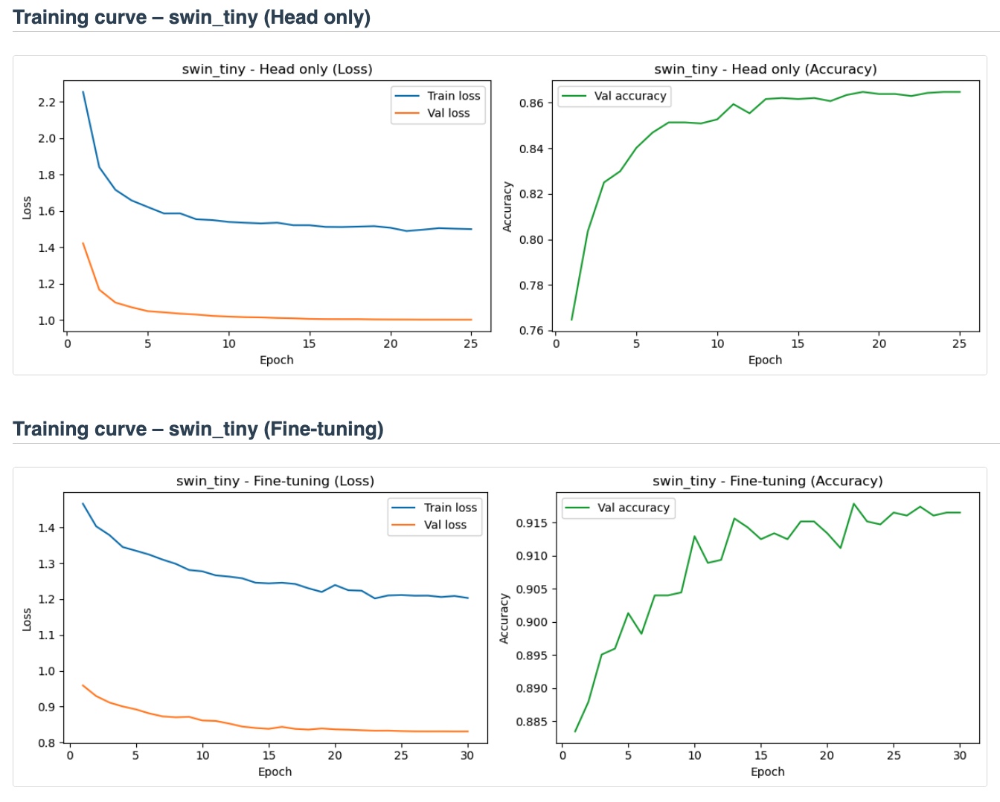
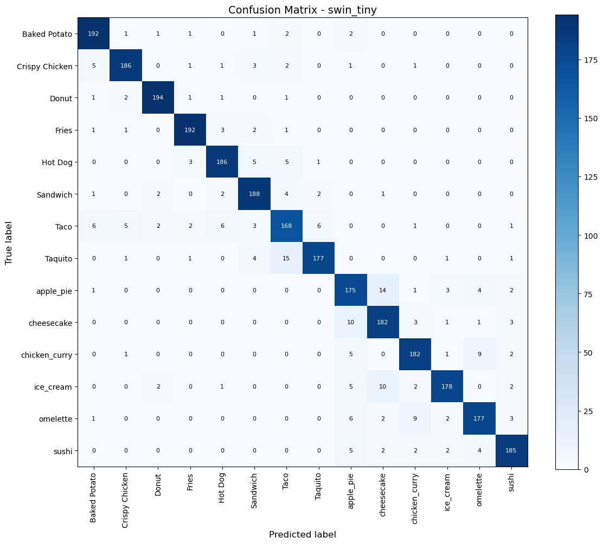

# Food Image Classification — Deep Learning with PyTorch


A Computer Vision project focused on **food image classification** using **PyTorch** and **transfer learning**.

The project explores how different deep learning architectures perform on a multi-class food dataset and provides a complete experimental pipeline for training, model comparison, and evaluation.

---

## Project Overview

The goal of this project is to build a robust image classifier capable of recognizing **14 food categories**.

The pipeline includes:

- a **baseline CNN trained from scratch**
- comparison of **multiple transfer learning architectures**
- automated **model selection based on validation performance**
- detailed evaluation through:
  - confusion matrix
  - precision / recall / F1-score
  - training curves

The project is designed with both **educational** and **experimental** purposes, showing how modern architectures improve classification performance over time.

---

## Model Performance

| Metric | Value |
|------|------|
| Task | 14-class food image classification |
| Dataset Size | 14,000 images |
| Models Compared | 6 architectures |
| Evaluation Outputs | Confusion matrix, classification report, training curves |
| Training Strategy | Baseline CNN + transfer learning + fine-tuning |

The project focuses on comparing architectures and building a **reproducible deep learning pipeline**, rather than presenting a single benchmark number in isolation.

---

## Dataset

The dataset contains **14,000 labeled food images** divided into three subsets.

| Split | Images |
|------|------|
| Train | 8,960 |
| Validation | 2,240 |
| Test | 2,800 |

**Total:** 14,000 images

### Food Classes

- Apple Pie
- Baked Potato
- Cheesecake
- Chicken Curry
- Crispy Chicken
- Donut
- Fries
- Hot Dog
- Ice Cream
- Omelette
- Sandwich
- Sushi
- Taco
- Taquito

Dataset download:

```text
https://proai-datasets.s3.eu-west-3.amazonaws.com/dataset_food_classification.zip
```

The notebook automatically downloads and prepares the dataset if it is not already available.

---

## Models Tested

Several deep learning architectures were evaluated.

| Model | Type | Notes |
|------|------|------|
| VGG16 | Classic CNN | Historical baseline architecture |
| ResNet50 | Residual CNN | Introduced residual connections |
| EfficientNet-B0 | Efficient CNN | Lightweight and efficient |
| EfficientNet-B4 | Scaled CNN | Larger version of EfficientNet |
| ConvNeXt-Tiny | Modern CNN | Transformer-inspired CNN design |
| Swin-Tiny | Vision Transformer | Transformer-based architecture |

Each model is trained using a **two-stage transfer learning strategy**:

1. **Head training** — backbone frozen
2. **Fine-tuning** — last layers of the backbone unfrozen

This allows faster convergence while preserving pretrained features.

---

## Results

### Training Curves



### Confusion Matrix



The evaluation pipeline generates:

- training and validation curves
- confusion matrix
- classification report
- automatic model comparison

---

## Repository Structure

```text
food-image-classification-cnn
│
├── notebook
│   └── gourmetai_food_classifier_v1.ipynb
│
├── images
│   ├── training_curves.png
│   └── confusion_matrix.png
│
├── requirements.txt
└── README.md
```

---

## How to Run

### Option 1 — Google Colab (Recommended)

1. Open the notebook in **Google Colab**
2. Run all cells
3. The dataset will be downloaded automatically

The full pipeline will:

- prepare the dataset
- train the baseline model
- train transfer learning models
- evaluate performance
- generate training visualizations

### Option 2 — Local Execution

Clone the repository:

```bash
git clone https://github.com/Nimus74/food-image-classification-cnn.git
cd food-image-classification-cnn
```

Install dependencies:

```bash
pip install -r requirements.txt
```

Open the notebook:

```text
notebook/gourmetai_food_classifier_v1.ipynb
```

Run all cells.

---

## Technologies Used

- Python
- PyTorch
- Torchvision
- Albumentations
- NumPy / Pandas
- Matplotlib
- Scikit-learn

---

## Hardware Compatibility

The project supports multiple hardware configurations:

| Hardware | Support |
|------|------|
| NVIDIA GPU (CUDA) | Full support |
| Apple Silicon (MPS) | Supported with fallback |
| CPU | Supported but slower |

The notebook automatically detects the available device.

---

## Future Improvements

Potential extensions of this project include:

- Test Time Augmentation (TTA)
- Vision Transformer models (ViT, DeiT)
- Larger EfficientNet variants
- Advanced augmentation (MixUp, CutMix)
- Hyperparameter optimization

---

## Author

**Francesco Scarano**  
Senior IT Manager | AI Engineering | Data & Digital Solutions

GitHub:  
https://github.com/Nimus74

LinkedIn:  
https://www.linkedin.com/in/francescoscarano/

---

This project was developed as part of the **AI Engineering Master program**, focusing on practical deep learning experimentation.
